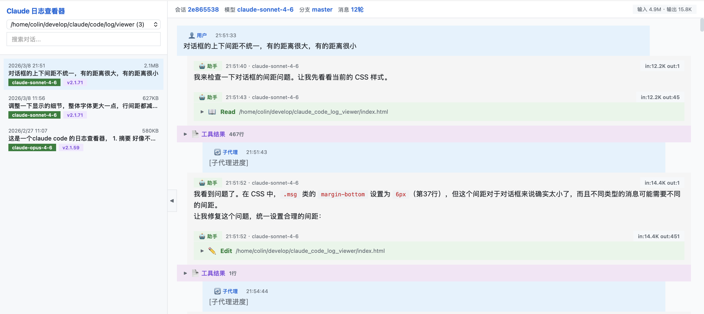

# Claude Code 日志查看器

可视化分析 Claude Code 对话日志的本地 Web 工具。



## 启动

```bash
cd log-viewer
python3 server.py        # 默认端口 8899
python3 server.py 9000   # 自定义端口
```

浏览器打开 `http://localhost:8899`

## 功能

- 自动扫描 `~/.claude/projects/` 下所有项目的对话日志
- 侧边栏按时间倒序列出对话，显示日期、大小、模型、版本
- 支持按关键词搜索对话内容、文件名、模型名
- 对话详情展示：用户消息（蓝色）、助手回复（白色）、摘要（黄色）
- 思考过程、工具调用、执行结果均可折叠/展开
- Bash 命令以终端风格渲染，JSON 彩色高亮，Markdown 富文本渲染
- 大文件工具结果（persisted-output）支持点击按钮异步加载完整内容
- 顶部显示会话元数据：模型、Git 分支、对话轮数、Token 用量

## 依赖

仅需 Python 3，无第三方依赖。前端库通过 CDN 加载（marked.js、highlight.js）。
