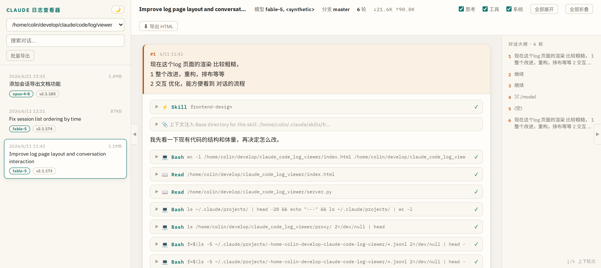

# Claude Code Log Viewer · Claude Code 日志查看器

> A zero-dependency local web tool to browse, read, and export your Claude Code conversation logs.
>
> 一个零依赖的本地 Web 工具，用于浏览、阅读并导出 Claude Code 的对话日志。

**English** · [中文说明](#中文说明)



---

## English

### Overview

Claude Code stores every conversation as a `.jsonl` file under `~/.claude/projects/`. Those files are great for machines and painful for humans. This tool reads them in place and turns each session into a clean, turn-by-turn reading view in your browser — and lets you **export any session (or a batch of them) as a self-contained HTML file you can read offline forever**.

No build step, no package manager, no database. Just Python 3 and a single HTML file.

### Features

- **Auto-discovery** — scans every project under `~/.claude/projects/` and lists its sessions.
- **Session list** — reverse-chronological, showing date, size, model, and CLI version; instant search across title, preview, filename, and model.
- **Turn-based reading view** — every real user prompt starts a turn card; the assistant's replies, thinking, tool calls, system events, and summaries are grouped beneath it.
- **Everything is inspectable** — thinking blocks, tool calls paired with their results, and long outputs are collapsible. Bash renders terminal-style, JSON is colorized, Markdown is rich-rendered, and code is syntax-highlighted.
- **Large tool outputs** — `persisted-output` results load their full content on demand.
- **Navigation** — an outline panel with click-to-jump, scroll-spy highlighting, and `j` / `k` keyboard movement.
- **Session metadata** — model(s), Git branch, turn count, and token usage in the header.
- **Light / dark theme**, remembered across visits.
- **Export to offline HTML** — single session or batch ZIP (see below).

### Quick Start

```bash
python3 server.py          # default port 8999
python3 server.py 9000     # custom port
```

Then open **http://localhost:8999** and pick a conversation from the sidebar.

### Export — offline & self-contained

Both export paths produce HTML that opens with **no internet and no this-tool**: all CSS, the small interaction scripts (collapse / theme / outline), and even large *persisted* tool outputs are inlined. There are **zero CDN references** in the output.

- **Single conversation → one HTML file.** Open a session and click **"⬇ 导出 HTML"** in the header. You get one `.html` named after the conversation title.
- **Batch → a ZIP of HTML files.** Click **"批量导出"** in the sidebar to enter selection mode, tick the sessions you want (or **"全选"** to select all), then **"导出选中"** to download a single ZIP — one offline HTML per session. The ZIP is assembled in pure JavaScript, so this stays dependency-free too.

### How It Works

- **`server.py`** — a tiny `http.server` REST API over `~/.claude/projects/`: list projects, list a project's sessions (with previews), return a session's entries, and lazily serve persisted tool-result files. Python 3 standard library only; includes basic path-traversal guards.
- **`index.html`** — a single-file SPA. A turn-based renderer groups the flat JSONL entries into turn cards. Markdown is rendered with marked.js and code highlighted with highlight.js (loaded from a CDN for the live viewer). Exports are pre-rendered to static HTML, so the exported files need neither library nor a network connection.

### Requirements

- **Python 3** — standard library only, nothing to `pip install`.
- The **live viewer** loads marked.js and highlight.js from a CDN; **exported HTML files are fully self-contained** and work offline.

### Bundled: API proxy (optional)

The `proxy/` directory is a separate, optional tool — a transparent local API proxy for Claude Code that logs every request/response to JSONL (with its own log viewer). See [`proxy/README.md`](proxy/README.md).

---

## 中文说明

[English](#english) · **中文**

### 简介

Claude Code 会把每一次对话以 `.jsonl` 文件的形式存放在 `~/.claude/projects/` 下。这些文件对机器友好，对人却很难读。本工具就地读取它们，把每个会话还原成浏览器里清爽的、按轮次阅读的视图，并且可以**把任意会话（或一批会话）导出成自包含的 HTML，永久离线阅读**。

无需构建、无需包管理器、无需数据库——只要 Python 3 和一个 HTML 文件。

### 功能

- **自动发现**——扫描 `~/.claude/projects/` 下的所有项目并列出其会话。
- **会话列表**——按时间倒序，显示日期、大小、模型、CLI 版本；支持对标题、预览、文件名、模型名的即时搜索。
- **按轮次阅读**——每一条真实的用户提问开启一张轮次卡片，助手的回复、思考、工具调用、系统事件、摘要都归在它下面。
- **一切可查**——思考块、工具调用与其结果的配对、超长输出都可折叠展开；Bash 以终端风格渲染，JSON 彩色高亮，Markdown 富文本渲染，代码语法高亮。
- **超大工具输出**——`persisted-output` 结果可按需点击加载完整内容。
- **导航**——大纲面板可点击跳转、滚动联动高亮，`j` / `k` 键盘上下切换轮次。
- **会话元信息**——头部显示模型、Git 分支、对话轮数、Token 用量。
- **明暗主题**——并跨次访问记忆。
- **导出为离线 HTML**——单会话或批量 ZIP（见下）。

### 启动

```bash
python3 server.py          # 默认端口 8999
python3 server.py 9000     # 自定义端口
```

然后浏览器打开 **http://localhost:8999**，从左侧选择一个对话。

### 导出——离线、自包含

两种导出方式产出的 HTML 都能在**不联网、也不依赖本工具**的情况下打开：所有样式、必要的交互脚本（折叠 / 主题 / 大纲），乃至超大的*持久化*工具输出，全部内联进文件，产出里**没有任何 CDN 引用**。

- **单会话 → 一个 HTML 文件**：打开会话后点头部的 **「⬇ 导出 HTML」**，得到一个以会话标题命名的 `.html`。
- **批量 → 一个 ZIP**：点侧栏的 **「批量导出」** 进入勾选模式，勾选想要的会话（或 **「全选」**），再点 **「导出选中」** 下载一个 ZIP——每个会话一个离线 HTML。ZIP 由纯 JavaScript 生成，因此同样零依赖。

### 工作原理

- **`server.py`**——基于 `http.server` 的极简 REST API，读取 `~/.claude/projects/`：列项目、列会话（含预览）、返回某会话的全部条目、按需提供持久化的工具结果文件。仅用 Python 3 标准库，并带有基础的路径穿越防护。
- **`index.html`**——单文件 SPA。按轮次的渲染器把扁平的 JSONL 条目组装成轮次卡片；Markdown 用 marked.js 渲染、代码用 highlight.js 高亮（在线查看时从 CDN 加载）。导出时内容已预渲染为静态 HTML，因此导出文件既不需要这些库、也不需要联网。

### 依赖

- **Python 3**——仅标准库，无需 `pip install`。
- **在线查看器**从 CDN 加载 marked.js 与 highlight.js；**导出的 HTML 完全自包含**，可离线使用。

### 附带：API 代理（可选）

`proxy/` 目录是一个独立、可选的工具——给 Claude Code 用的透明本地 API 代理，会把每次请求/响应记录为 JSONL（并自带日志查看器）。详见 [`proxy/README.md`](proxy/README.md)。
